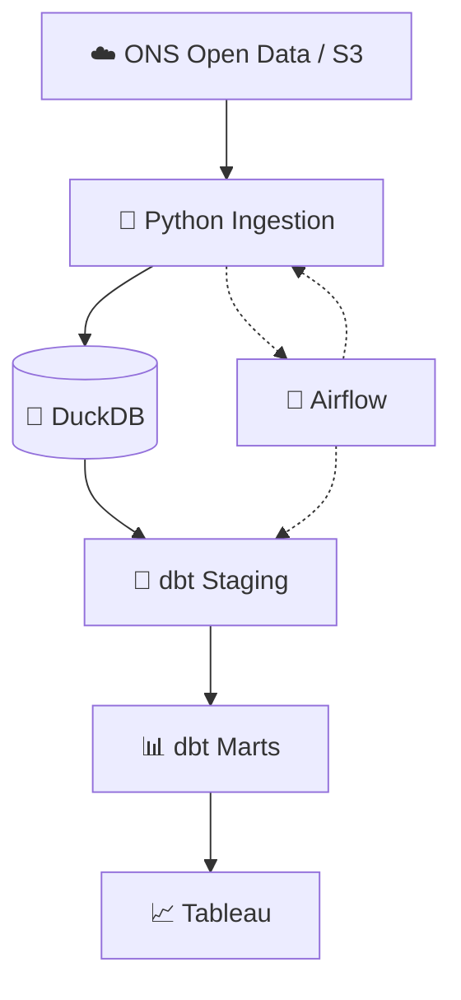

# ONS Hourly Generation by Power Plant — Data Engineering Pipeline

## 📌 Project Overview

This project builds an end-to-end data engineering pipeline using open data from the **ONS (Operador Nacional do Sistema Elétrico)**.

The main dataset contains **hourly electricity generation by power plant**, allowing the project to explore electricity generation patterns in Brazil while providing a practical environment to develop and demonstrate data engineering skills.

The project is designed around a modern data pipeline architecture using:

* 🐍 **Python** — data extraction and ingestion
* 🦆 **DuckDB** — local analytical database and raw data storage
* 🔧 **dbt** — data transformation, testing, documentation and lineage
* 🛫 **Airflow** — pipeline orchestration *(planned)*
* 📊 **Tableau** — data visualization and analytics *(planned)*

The project is being developed incrementally, with the objective of eventually creating a fully automated and reproducible pipeline.

---

## 📊 Dataset Context

### Hourly Generation by Power Plant

**Source:** ONS Open Data Portal

**Dataset:** `Geração por Usina em Base Horária`

The dataset contains hourly electricity generation information at plant level, including generation from individual plants, plant clusters and groups of small power plants.

### Data coverage

* **2000–2021:** Files are generally grouped by year.
* **2022–Present:** Files are generally grouped by month.

The ONS source may also perform consistency processes that update historical data after the original publication. Therefore, the ingestion pipeline needs to account for files that may have been modified after their initial ingestion.

### Plant classification

The ONS dataset includes different types of plant/group classifications, including:

* **Type II-C:** Plant sets/clusters established through operational adjustments.
* **Type III:** Groups of small power plants that do not interact directly with ONS; generation data may represent estimated or forecasted generation.

---

# 🏗️ Architecture

The project follows a separation of responsibilities between ingestion, storage and transformation.



### Responsibilities

| Layer         | Technology | Responsibility                          |
| ------------- | ---------- | --------------------------------------- |
| Source        | ONS        | Public electricity generation data      |
| Ingestion     | Python     | Discover, download and load source data |
| Raw           | DuckDB     | Store source data locally               |
| Staging       | dbt        | Clean, standardize and prepare data     |
| Marts         | dbt        | Create analytical datasets              |
| Orchestration | Airflow    | Automate and schedule the pipeline      |
| Visualization | Tableau    | Build analytical dashboards             |

---

# 🔄 Data Flow

The pipeline is being designed around the following flow:

### 1. ONS → Python

Python connects to the ONS public S3 bucket and identifies available source files.

The ingestion layer is responsible for:

* Discovering available files
* Downloading ONS files
* Handling annual and monthly files
* Detecting new or modified files
* Standardizing source columns
* Loading data into DuckDB

The ingestion code lives outside the dbt project.

```text
ingestion/
├── __init__.py
├── ons_s3.py
├── load.py
├── extract_generation.py
└── extract_modalidade.py
```

---

### 2. Python → DuckDB

DuckDB is used as the local storage and analytical engine.

The project uses a single DuckDB database:

```text
data/
└── ons_data.duckdb
```

The raw layer is created by the Python ingestion process.

Current raw tables include:

```text
raw.generation
raw.modalidade_usina
```

Python is responsible for creating and updating these tables.

---

### 3. DuckDB Raw → dbt Staging

dbt does not perform the initial extraction from ONS.

Instead, dbt treats the DuckDB raw tables as **sources**.

Example:

```sql
SELECT *
FROM {{ source('ons_raw', 'generation') }}
```

The staging layer is responsible for preparing the raw data for analytical modeling.

```text
models/
└── staging/
    ├── stg_geracao_usina.sql
    └── stg_modalidade_usina.sql
```

Staging models are intended to remain lightweight and are materialized as views.

---

### 4. Staging → dbt Marts

The mart layer contains the datasets intended for analytical consumption.

The planned structure includes:

```text
models/
└── marts/
    ├── fct_geracao_usina.sql
    ├── fct_geracao_usina_current.sql
    └── dim_modalidade_usina.sql
```

#### `fct_geracao_usina`

Historical fact table containing the hourly generation records.

This will be the main historical analytical dataset.

#### `fct_geracao_usina_current`

Current/latest generation dataset.

The current design uses the **latest available hour**:

```text
MAX(din_instante)
```

This allows the project to expose the most recent generation data without duplicating the complete historical table.

#### `dim_modalidade_usina`

Dimension table containing the classification/modality information for the power plants.

---

# 📁 Project Structure

```text
ons_data/
│
├── data/
│   └── ons_data.duckdb
│
├── ingestion/
│   ├── __init__.py
│   ├── ons_s3.py
│   ├── load.py
│   ├── extract_generation.py
│   └── extract_modalidade.py
│
├── models/
│   ├── sources.yml
│   │
│   ├── staging/
│   │   ├── stg_geracao_usina.sql
│   │   └── stg_modalidade_usina.sql
│   │
│   └── marts/
│       ├── fct_geracao_usina.sql
│       ├── fct_geracao_usina_current.sql
│       └── dim_modalidade_usina.sql
│
├── dags/
│   └── ons_pipeline.py
│
├── analyses/
├── macros/
├── seeds/
├── snapshots/
├── tests/
├── target/
│
├── dbt_project.yml
├── README.md
└── .gitignore
```

> The `target/` directory and local DuckDB database are development artifacts and should not be committed to Git.

---

# 🛠️ Tech Stack

## Python

Used for the ingestion layer.

Main responsibilities:

* ONS S3 interaction
* File discovery
* File download
* Change detection
* Data standardization
* Loading data into DuckDB

---

## DuckDB

Used as the project's local analytical database.

Advantages for this project include:

* Embedded database
* No external database server required
* Excellent analytical performance
* SQL support
* Easy integration with Python and dbt
* Portable local development environment

Database location:

```text
data/ons_data.duckdb
```

---

## dbt

dbt is responsible for the transformation layer.

Current architecture:

```text
raw
 ↓
staging
 ↓
marts
```

dbt is also intended to provide:

* Data quality tests
* Documentation
* Model lineage
* Incremental transformations
* Analytical data modeling

The raw layer is **not created by dbt**. It is populated by the Python ingestion process and exposed to dbt through `sources.yml`.

---

## Airflow

Airflow will eventually orchestrate the complete pipeline.

The intended workflow is approximately:

```text
Discover ONS files
       ↓
Extract / Download
       ↓
Load Raw DuckDB
       ↓
dbt run
       ↓
dbt test
       ↓
Update analytical datasets
```

Airflow integration is still under development.

---

## Tableau

Tableau will eventually consume the analytical mart layer.

Potential dashboards include:

* Electricity generation overview
* Generation by source/modality
* Generation by power plant
* Hourly generation trends
* Historical generation
* Latest generation status
* Renewable vs non-renewable generation

Tableau integration is still planned.

---

# 🔍 Data Engineering Concepts Demonstrated

This project is intentionally designed as a portfolio project for modern data engineering.

It demonstrates concepts including:

* API / cloud data extraction
* S3 file discovery
* Incremental ingestion
* Change detection
* ETL / ELT
* Raw / staging / mart architecture
* Data modeling
* Fact and dimension tables
* dbt sources
* dbt transformations
* dbt incremental models
* Data quality testing
* Data lineage
* Local analytical databases
* Pipeline orchestration
* Business intelligence

---

# 🚧 Project Roadmap

The project is still under development.

### ✅ Completed / In Progress

* [X] Connect to ONS public data
* [X] Discover ONS S3 files
* [X] Create Python ingestion structure
* [X] Separate ingestion from dbt transformations
* [X] Create DuckDB storage under `data/`
* [X] Create raw generation table architecture
* [X] Create raw modalidade table architecture
* [X] Configure dbt sources
* [X] Define staging layer
* [ ] Complete generation ingestion/change detection
* [X] Complete historical generation mart
* [X] Complete latest-hour generation model
* [X] Complete modalidade dimension
* [ ] Add comprehensive dbt tests
* [ ] Add dbt documentation
* [ ] Add Airflow DAG
* [ ] Automate the complete pipeline
* [ ] Add pipeline logging and monitoring
* [ ] Connect Tableau
* [ ] Build analytical dashboards
* [ ] Containerize the project with Docker
* [ ] Add CI/CD
* [ ] Add automated pipeline execution

---

# 🎯 Final Architecture Goal

The final project is intended to operate as an automated pipeline:

```text
                 ┌─────────────────┐
                 │   ONS Open Data │
                 └────────┬────────┘
                          │
                          ▼
                 ┌─────────────────┐
                 │ Python Ingestion│
                 └────────┬────────┘
                          │
                          ▼
                 ┌─────────────────┐
                 │     DuckDB      │
                 │   Raw Layer     │
                 └────────┬────────┘
                          │
                          ▼
                 ┌─────────────────┐
                 │      dbt        │
                 │    Staging      │
                 └────────┬────────┘
                          │
                          ▼
                 ┌─────────────────┐
                 │      dbt        │
                 │      Marts      │
                 └────────┬────────┘
                          │
                ┌─────────┴─────────┐
                ▼                   ▼
        ┌──────────────┐    ┌──────────────┐
        │   Tableau    │    │   Analytics  │
        │  Dashboards  │    │    / SQL     │
        └──────────────┘    └──────────────┘

                  ▲
                  │
          ┌───────┴───────┐
          │    Airflow    │
          │ Orchestration │
          └───────────────┘
```

---

# 📚 Project Objective

The objective is not only to analyze ONS electricity generation data, but to build a realistic **end-to-end data engineering project** that demonstrates how raw public data can be transformed into reliable analytical datasets.

The project is being developed incrementally, with emphasis on:

**reproducibility → data quality → automation → scalability → analytics.**
